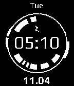

Demo Pebble Watchface
=========================
My first basic Pebble watchface to just try out the different features available. Based on J.A.R.V.I.S. interface.

<h2>Installation</h2>

To install this watchface on your pebble, follow the instructions:

1. Clone the repo locally using "git clone https://github.com/gopinathdanda/pebble-watchface-tutorial local_directory".
2. Turn on "Developer Mode" in your Pebble app. Note down the IP address in the Developer window. [https://developer.getpebble.com/2/additional/developer-connection/]
3. Make sure you have Pebble SDK installed. [https://developer.getpebble.com/download-sdk/]
4. Run "pebble build" inside the cloned directory.
5. Run "pebble install --phone IP_ADDRESS_OF_PHONE".
